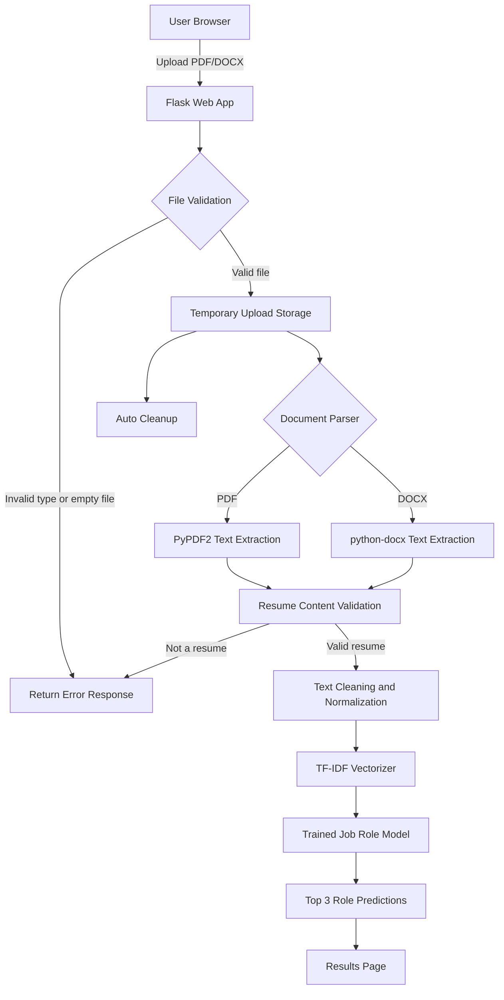

# AI Resume Analyzer

A Flask-based machine learning web application that analyzes a resume and predicts the top matching job roles from the resume content. The app supports PDF and DOCX uploads, extracts text, validates that the uploaded document looks like a resume, transforms the text with a saved vectorizer, and returns the top 3 predicted roles using a trained model artifact.

[](https://www.python.org/)
[](https://flask.palletsprojects.com/)
[](https://scikit-learn.org/)
[](https://www.docker.com/)

## Features

- Upload resumes in PDF or DOCX format.
- Extract resume text with `PyPDF2` and `python-docx`.
- Validate uploaded documents using common resume sections and keywords.
- Clean and normalize resume text before prediction.
- Use saved ML artifacts: `vectorizer.pkl` and `job_role_model.pkl`.
- Display the top 3 predicted job roles.
- Automatically delete uploaded files after processing.
- Provide a `/health` endpoint for deployment checks.
- Run locally, with Docker, Docker Compose, or cloud platforms.

## Architecture



## Tech Stack

| Layer | Technology |
| --- | --- |
| Backend | Flask |
| Machine Learning | scikit-learn, joblib |
| Resume Parsing | PyPDF2, python-docx |
| Frontend | HTML, CSS, JavaScript |
| Packaging | Docker, Docker Compose |
| Deployment Config | Vercel, Docker, cloud-ready environment variables |

## Project Structure

```text
resume_analyser/
├── app.py                 # Flask app, routes, parsing, validation, prediction
├── templates/
│   └── index.html         # Resume upload UI
├── uploads/               # Temporary upload directory
├── job_role_model.pkl     # Trained ML model artifact
├── vectorizer.pkl         # Saved text vectorizer artifact
├── mlproject.ipynb        # Model development notebook
├── requirements.txt       # Python dependencies
├── Dockerfile             # Container build configuration
├── docker-compose.yml     # Local container orchestration
├── vercel.json            # Vercel deployment configuration
├── DEPLOYMENT.md          # Deployment notes
├── .env.example           # Example environment configuration
└── .dockerignore          # Docker build exclusions
```

## Getting Started

### Prerequisites

- Python 3.11 or later
- `pip`
- Optional: Docker and Docker Compose

### Local Setup

```bash
git clone https://github.com/Godesivaramakrishna/resume_analysis.git
cd resume_analysis
pip install -r requirements.txt
python app.py
```

Open the application at:

```text
http://localhost:5000
```

### Docker Setup

```bash
docker build -t resume-analyzer .
docker run -p 5000:5000 resume-analyzer
```

Or use Docker Compose:

```bash
docker-compose up -d
```

## Usage

1. Open the web application.
2. Upload a resume in `.pdf` or `.docx` format.
3. Submit the file for analysis.
4. Review the top 3 predicted job roles.
5. Upload another resume if needed.

## API Endpoints

| Method | Endpoint | Description |
| --- | --- | --- |
| `GET` | `/` | Renders the resume upload page. |
| `POST` | `/predict` | Accepts a resume file and returns top role predictions. |
| `GET` | `/health` | Returns service and model loading health status. |

### Prediction Request

Send a multipart form request with the resume file under the `resume` field.

```bash
curl -X POST http://localhost:5000/predict \
  -F "resume=@sample_resume.pdf"
```

## Configuration

The application reads configuration from environment variables and falls back to local defaults.

| Variable | Default | Description |
| --- | --- | --- |
| `PORT` | `5000` | Port used by the Flask server. |
| `HOST` | `0.0.0.0` | Host interface for the Flask server. |
| `MAX_CONTENT_LENGTH` | `16777216` | Maximum upload size in bytes, 16 MB by default. |
| `SECRET_KEY` | `dev-secret-key-change-in-production` | Flask secret key. Change this in production. |
| `UPLOAD_FOLDER` | `uploads` | Temporary file upload directory. |
| `MODEL_PATH` | `job_role_model.pkl` | Path to the trained model artifact. |
| `VECTORIZER_PATH` | `vectorizer.pkl` | Path to the saved vectorizer artifact. |
| `DEBUG` | `False` | Enables Flask debug mode only outside production. |

## Security and Privacy

- Only `.pdf` and `.docx` files are accepted.
- Uploaded file names are replaced with UUID-based names.
- Upload size is limited through Flask configuration.
- Files are deleted after processing.
- The app does not intentionally persist resume content.
- Production deployments should set a strong `SECRET_KEY` and serve the app behind HTTPS.

## Deployment

The repository includes:

- `Dockerfile` for container builds.
- `docker-compose.yml` for local container execution.
- `vercel.json` for Vercel deployment.
- `DEPLOYMENT.md` with additional deployment guidance.

For Docker-based production deployments, build the image and run it behind a reverse proxy or managed container service.

## Model Artifacts

The prediction pipeline depends on two files in the project root:

- `vectorizer.pkl`: transforms cleaned resume text into model features.
- `job_role_model.pkl`: predicts job-role scores from the vectorized resume text.

Both files must be present when running the application locally or inside a container.

## Author

**Gode Sivaramakrishna**

- GitHub: [@Godesivaramakrishna](https://github.com/Godesivaramakrishna)
- Repository: [resume_analysis](https://github.com/Godesivaramakrishna/resume_analysis)
